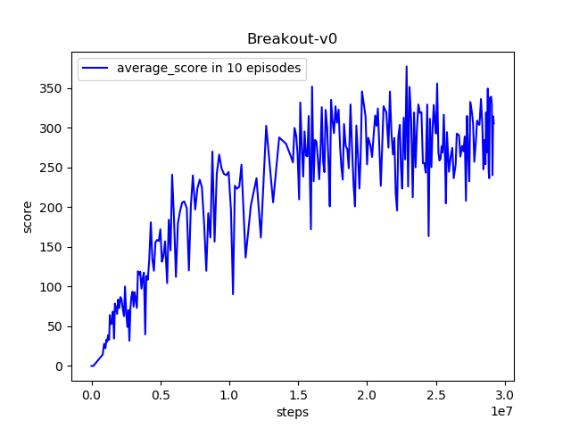

## Atari-A3C(CPU-only)
```shell
nohup python -u main.py 2>&1 &
```
### HyperParameters

|      Name       |                   Description                    |    Value    |
| :-------------: | :----------------------------------------------: | :---------: |
|   gae_lambda    |             lambda parameter for GAE             |    1.00     |
|      gamma      |           discount factor for rewards            |    0.99     |
|       lr        |                  learning rate                   |   0.0001    |
|  entropy_coef   |             entropy term coefficient             |    0.01     |
| value_loss_coef |              value loss coefficient              |     0.5     |
|  max_grad_norm  |         clamping the values of gradient          |     40      |
|  num_processes  | how many training processes to use(asynchronous) |     32      |
|    num_steps    |          number of forward steps in A3C          |     20      |
|    no_shared    |     use an optimizer without shared momentum     |    False    |
|    env_name     |             environment to train on              | Breakout-v0 |

### Result (training)

#### Test score per 5 episodes as training goes on

> Still training in GPU server.
>
> Suddenly goes down may because of the action 'fire' problem. (We don't use wrappers.)



#### Simulation


### Problems

> Do not use wrappers whose input is [4, 84, 84], it indeed influences the preformance of the model. After 40000K steps, only get score below 100. See [log](../A3C_Wrappers/logs/Breakout-v0_test_log).

### Logs

[log1 - 17000K steps](./res/Breakout-v0_test_log)

### [Model](./model.pt)

```shell
# You can use the pre-trained model to see the simulation, or use it as your baseline.
# Test the model and see the simulation.
python utils.py
```

### Note

```shell
# Do not change below code in main.py, it will cause some bugs in Ubuntu.
mp.set_start_method("spawn")
os.environ['OMP_NUM_THREADS'] = '1'
os.environ['CUDA_VISIBLE_DEVICES'] = ""
os.environ['KMP_DUPLICATE_LIB_OK'] = 'True'
```

