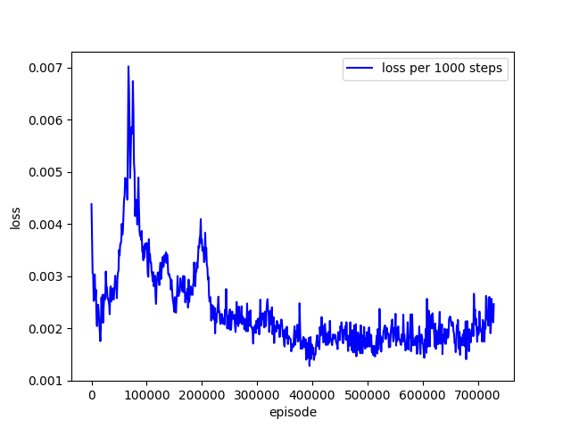
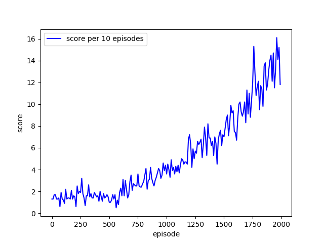
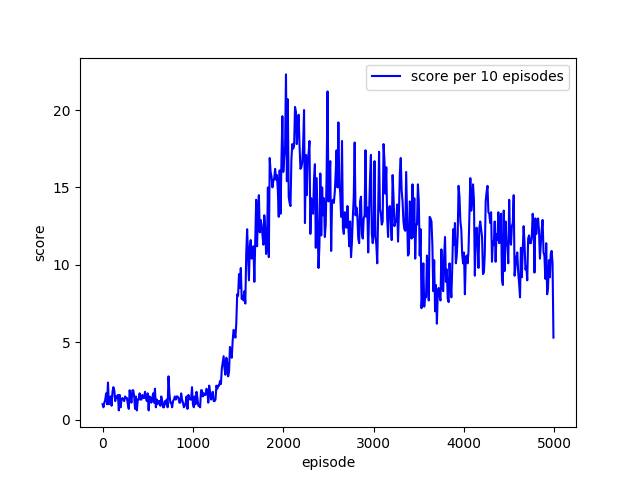

## Atari-DRL
```shell
nohup python -u main.py 2>&1 &
```
### HyperParameters

|      Name      |             Value              |
| :------------: | :----------------------------: |
|   BATCH_SIZE   |               32               |
|     GAMMA      |              0.99              |
|       lr       |              1e-4              |
|  MEMORY_SIZE   |             1000K              |
| INITIAL_MEMORY |              100K              |
|  Model_Input   |    [Batch_size, 4, 84, 84]     |
|  Model_Output  |          Action_nums           |
|   EPS_START    | 1.0 -> 0.06(after 1000K steps) |
|   Optimizer    |              Adam              |

### Result (training)

#### loss per 1000 steps



#### score per 10 episodes



### Problems

> not converge.
>
> loss will increase and reward decrease after 1500K steps.



### Logs

[log1 - 3000K steps](./res/nohup1.out)

[log2 - 1580K steps](./res/nohup2.out)

