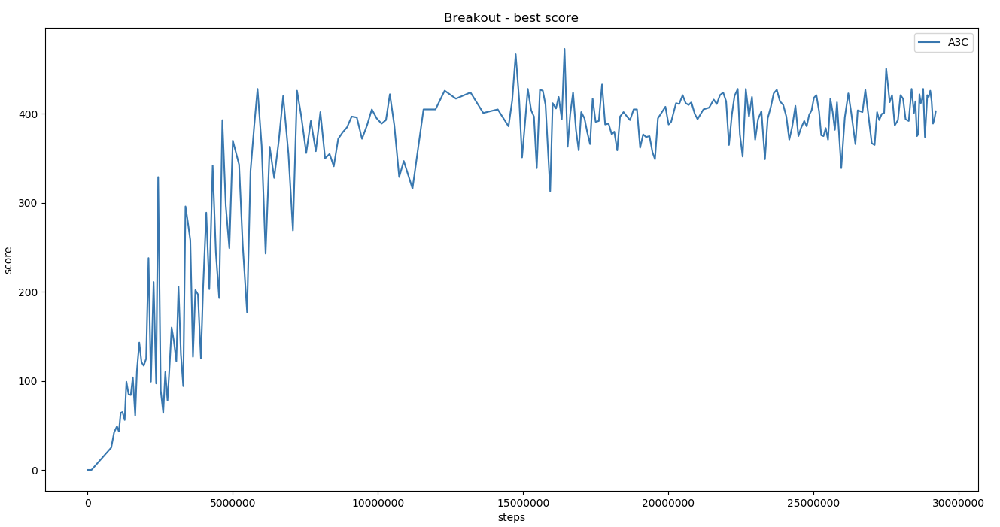

## Atari-Breakout-DRL

> **Team members**: @[andychinka](https://github.com/andychinka), @[kkaryl](https://github.com/kkaryl), @[Skye](https://github.com/RoyalSkye), @[Tanmengxuan](https://github.com/Tanmengxuan), @[TeoChekLiang](https://github.com/TeoChekLiang)
>
> * [DQN](./DQN)
> * [Noisy DQN](./Noisy_DQN)
> * [A3C](./A3C_DefaultENV)

### Abstract

In this project, we compare three Deep Reinforcement Learning (DRL) algorithms, namely the Deep Q-network (DQN), the NoisyNet DQN, and the Asynchronous Advantage Actor-Critic (A3C) algorithms. Firstly, we explore DQN with a variant of itself, in particular the NoisyNet DQN, to see how noise in the weights of the neural network of the DQN improves the performance of the algorithm. Next, with the A3C shown to have much more learning capabilities and requiring less computational time, we discuss why each of the characteristics of the A3C improves learning performance compared to the standard DQN. Lastly, we conduct a critical evaluation of the DRL algorithms on possible drawbacks and improvements.

### 1. Introduction

#### 1.1 Context

Reinforcement learning (RL) can be largely classified into two main methods, namely the Value- Based method and the Policy-Based method. For the Value-Based method, the algorithm aims to identify the optimal value function upon mapping an action to its corresponding value. The algorithm will then decide on the action that returns it the highest value. For the Policy-Based method, the algorithm identifies directly the optimal policy without using any value functions.

Either of these two methods has their own advantages. The Policy-Based methods perform better in continuous, high-dimensional and stochastic environments, and taking less time to con- verge. Separately, Value-Based methods are more sample efficient and steady. Furthermore, each of these methods can be enhanced for the corresponding algorithms to perform even better. In particular, the introduction of a neural network to these methods bring about flexible function approximations with the potential for a low asymptotic approximation error, and the determinism of the environments prevents the harmful effects of noise [1]. This provides the notion of deep reinforcement learning (DRL).

#### 1.2 Problem Statement

In this project, our objective is to learn and implement DRL algorithms to solve OpenAI Gym’s Atari game setups. We aim to experiment with both Value-Based and Policy-Based algorithms so as to understand the advantages and limitations between them. Given the wide range of possible further DRL method enhancements, we seek to explore how these different enhancements on DRL methods could improve their performances.

### 2. Methodologies

#### 2.1 Experiment Design

We begin this investigation by using a vanilla DRL algorithm as a base for comparison, i.e. the Deep Q-Network algorithm (DQN). The DQN adds on a multi-layered neural network on top of the standard Value-Based Q-Learning method such that for a given state s, an output of a vector of action values Q(s·;θ) is returned, where $\theta$ is the parameters of the network. For an n-dimensional state space and an action space containing m actions, the neural network is a function from ${\rm I\!R}^n$ to ${\rm I\!R}^m$. Mnih et al. (2015) [2] suggested two important characteristics of the DQN algorithm, namely having a target network, and the use of experience replay.

For the first enhancement, we explore introducing noise on the weights in the neural network of the DQN (NoisyNet DQN as a result) via a parametric function of the noise to investigate how much its performance can be improved. The noise induces stochasticity to the agent, increasing efficiency to the agent’s exploration efforts [3].

Secondly, we select an algorithm that combines both Value-Based and Policy-Based methods, namely the Asynchronous Advantage Actor-Critic algorithm (A3C), to investigate if a combination of these two methods yields better performance. The A3C builds on top of the Actor-Critic method (a method which combines both Value-Based and Policy-based methods by predicting both the value function as well as the optimal policy function) by having multiple learning agents to interact with their environments based on each of their own network parameters. They will then update the global network that controls the learning agents such that more knowledge is gained. At the same time, the global network will feed information to the other learning agents to improve their decision making. In addition, the A3C creates new information by enabling the learning agents to learn how much better the rewards are than its expectations.

In this project, we choose ”Breakout” as our target game. OpenAI Gym is used to build the game environment, and there are several different versions of the same game such as ”v0”, ”v4”, and ”Deterministic”. Our final choice of the environment is ”Breakout-v0”.

#### 2.2 Data Pre-processing

Although Gym has already provided the environment, there are still some data pre-processing that can be useful in enhancing our model accuracy and performance. In our model, we use the state / observation from the environment as our training data, where the state is simply an RGB image with shape (210, 160, 3).

Firstly, as the colour of the image is not as important in teaching the agent to play the game well, we convert the original image to a grey-scale image to reduce the resolution of the image and therefore, the input size. The final size of the image is (80, 80, 1). The before and after processing frames are shown in Figure 2.1.

Besides reducing the size of the input, we find that it will be useful to input a sequence of states to the model instead of one single state as additional information such as the velocity of the pixels can be included. As such, we stack the last 4 states into one input for the model as seen in Figure 2.2.

  
   
  Figure 2.1: Before and After Frame Processing

   
  Figure 2.2: Stacking the last 4 frames

2.3 Deep Q-Network (DQN)

The DQN was introduced in 2013 [4]. It is known as a variant of the Q-learning algorithm and is trained using a Convolutional Neural Network (CNN). The input of the CNN is the sequence of state, and the outputs are the corresponding Q-values for each action.

  

This is a model-free, off-policy algorithm, meaning that the training data is directly collected during the agent playing. The Epsilon-Greedy exploration strategy is used by the model to select the behaviour distribution with probability 1 - ε, and select a random action with probability ε.

In its implementation, the Experience Replay method is used to train the model. We define a fixed memory size to store the last N experiences (states, rewards, action), and randomly sample it for every iteration of training. This approach can break the correlations between experiences in order to avoid over-fitting.

  

For our experiment, our network design is shown in Figure 2.3.

   
  Figure 2.3: Deep Q Net

#### 2.4 NoisyNet Deep Q-Network (NoisyNet DQN)

Meire, et al. introduced NoisyNet in 2017 [3], which is an alternative approach to the Epsilon- Greedy exploration strategy commonly used in DQN. It aims to improve the efficiency of explo- ration in reinforcement learning, by injecting noise into the parameters in the output layer of a neural network.

The agent explores whenever there is noise in the sampled output of the neural network. This is achieved by replacing the dense linear layers in the model with noisy dense layers. The variance in the noise are learnt the same way as the other parameters of the agent, via gradients from the reinforcement loss function.

The noisy linear layer is computed as follows:

  

Other than the epsilon terms,  and , which are generated using factorised Gaussian noise, all other parameters are trainable. Over time, the agent will update the weights of the sigma terms,  and , till they are close to zero. The difference is that the agent will tune the weights at the pace of which its environment demands instead of using the pre-defined scheduled epsilon.

In the paper [3], Meire et al. claimed to achieved sub- to super-human performance for most games with the use of NoisyNet as the exploration strategy for DQN, A3C and Duelling [5] agents. However, we did not use NoisyNet for A3C in our subsequent experiments because the paper [3] reported poor result of NoisyNet A3C on the ”Breakout” game. Our experiment’s network design for NoisyNet DQN is shown in Figure 2.4.

   
  Figure 2.4: Deep Q Net with Noisy Linear

#### 2.5 Asynchronous Advantage Actor-Critic (A3C)

The DQN algorithm described in the previous sections belongs to Valued-Based DRL algo- rithms. However, Value-Based methods can oscillate or chatter or even diverge if performed wrongly. On the contrast, Policy-Based DRL methods have better convergence properties as they directly follows the policy gradient. Although they usually converge to only to a local optimum, Policy-Based methods are effective in high-dimensional or continuous action spaces, and they can learn stochastic policies [6]. Unfortunately, one of the drawbacks is that they tend to be inefficient with high variance. In practice, one way to solve the problem is to include a value function to combine both value-based and policy-based methods. As a result, we will use the A3C, which uses both Valued-Based and Policy-Based methods, to play Atari games.

There are many algorithms in policy gradient literature. If the policy objective function  is not differentiable, we can compute gradients by Finite Differences. Otherwise, based on the Policy Gradient Theorem: For any differentiable policy , for any of the policy objective functions , the policy gradient is

  

Monte-Carlo Policy Gradient(REINFORCE) uses return vt as an unbiased sample of , but it has high variance. To reduce the variance, Actor-Critic algorithms, which follow an approx- imate policy gradient, use a critic to estimate the action-value function. It maintains two sets of parameters, one where the critic updates the action-value function parameters w, and the other where the actor updates the policy parameters θ in the direction suggested by the critic. Further, to reduce variance of policy gradient significantly without changing its expectation, the advan- tage function is used [6]. The gradient can be rewritten using the following advantage function .

  

  

For the true value function , the Temporal Difference (TD) error  is an unbiased estimate of the advantage function [6]. Hence, we can use the TD error to compute the policy gradient.

  

In practice, we can use an approximate TD error  which only requires one set of critic parameters v.

  

A3C is the asynchronous version of advantage actor-critic (A2C). The pseudocode is presented in Algorithm 2. The policy and value functions are updated after every  actions or when a terminal state is reached. The update performed by the algorithm can be seen as  where  is an estimate of the advantage function given by  where k varies from state to state and is upper-bounded by  [7].

David Silver et al. [7] also found that adding the entropy of the policy π to the objective function improved exploration by discouraging premature convergence to sub-optimal deterministic policies. The gradient of the full objective function including the entropy regularisation term with respect to the policy parameters takes the form below, where H is the entropy.

  

The hyperparameter  controls the strength of the entropy regularisation term.

  

As with the Value-Based methods we rely on parallel actor-learners and accumulated updates for improving training stability. In this algorithm, multi-workers can work asynchronously to train the model. By means of share memory mechanism in PyTorch, all workers can update the model asynchronously. The model is presented in Figure 2.5.

   
  Figure 2.5: A3C model structure

In this model, a CNN is used to extract the feature of images and a Long Short-Term Memory (LSTM) is used to process temporal dependencies. Thereafter, the two fully-connected layers which sit at the top of the network will provide the probability distribution and value function approximation given the current state.

Instead of the experience replay used in DQN, the A3C asynchronously execute multiple agents in parallel on multiple instances of the environment. This parallelism decorrelates the agents’ data into a more stationary process and make the model learn online, since at any given time-step, the parallel agents will be experiencing a variety of different states.

### 3. Experiment Evaluation

#### 3.1 NoisyNet DQN vs DQN

The DQN uses the Epsilon-Greedy strategy to find the trade-off between exploration and ex- ploitation. This strategy uses a decreasing probability such that exploration is minimised over time. For instance, reducing the probability from 1.0 to 0.01 will mean that the agent will prefer exploitation over exploration at latter time steps.

The problem with the DQN is that it heavily depends on a pre-defined hyperparameter, i.e. the epsilon decay. However, different scenarios or games may require varying epsilon decay for efficient exploration to take place.

The idea behind the NoisyNet DQN is to allow the agent to learn exploration just as it learns to perform the best actions using a neural network. Hence, the fully connected layers would have weights to be optimised and over time the value of sigma slowly decreasing to close to zero to neutralise the epsilon when exploration is less required.

From Figure 3.1a and 3.1b, we see that the NoisyNet DQN consistently outperforms the vanilla DQN in terms of both average and best scores over the period of last 10 episodes. Additionally, in comparison with the Epsilon-Greedy strategy, we also find that the NoisyNet exploration will lead to faster convergence and allows the agent to achieve higher scores in fewer number of training steps. However, one slight disadvantage of NoisyNet DQN as compared to the vanllia version is that it contains more training parameters and have a greater computational overhead.

#### 3.2 A3C vs DQN-methods

For the A3C, the setup is with 32 actor-learner threads running on a single server and no GPU. Each worker performed updates after every 20 actions (tmax = 20) and a shared Adam with 0.0001 learning rate was used for optimisation. The Atari environment was preprocessed into [80, 80] as input. The network used four convolutional layers with 32 filters of size 3 3 with stride 2, followed by a LSTM layer with hidden states dimension 512, followed by two fully connected layers for policy and value function approximation. All convolutional layers were followed by a rectifier nonlinearity. The model used by actor-critic agents had two set of outputs - a softmax output with one entry per action representing the probability of selecting the action, and a single linear output representing the value function. Generalized Advantage Estimation [8] was used to reduce the variance and improve performance. In the course of calculating loss, we assign 1.0, 0.5 and 0.01 as the weight to policy, value loss and entropies respectively. Furthermore, we clamp the values of gradient between 0 and 40 to prevent the gradient from taking huge values and degenerating the algorithm. Figure 3.1c and 3.1d show the average and best scores in 10 episodes after training for 35 hours. The results show that the A3C has a good result and better convergence properties compared with DQN or NoisyNet DQN. It starts to converge after training for 10M steps, while the DQN-methods may oscillate or chatter. The average score and best scores went beyond 350 and 400 respectively. During training, the DQN-methods requires a lot of computational resources. They tend to require about 150GB of memory if the size of experience replay memory is 1M. Contrastingly, the A3C can learn online and does not need to store the transitions.

   
  (a) DQN Average score 
   
  (b) DQN Best score 
   
  (c) A3C Average score 
   
  (d) A3C Best score 
  Figure 3.1: Test score recorded every 10 episodes

### 4. Conclusion

This project demonstrates two enhanced versions of vanilla DRL algorithms and clarifies reasons as to why each of the enhanced version has a better performance. Introducing noise on the neural network for NoisyNet DQN as well as the advantage function of the A3C on the value function are discussed to show enhancements to learning. Having multiple learning agents such as in the A3C has also proven to perform better than having only a single agent.

One drawback of the DQN algorithm is that it stores the last N experiences in the replay memory and samples uniformly at random when updating [4]. This approach can be limiting as due to the finite memory size, important experiences could be overwritten by recent experiences. Similarly, the uniform sampling allows all experiences to have equal importance. Having a more sophisticated sampling strategy may emphasise experiences from which we can learn the most, similar to prioritised sweeping [9].

While Meire et al. [3] explored using noise as an enhancement to A3C on ”Breakout” and the results seemed to fare poorly, most of the other Atari games had positive results. Additionally, the A3C can be enhanced through modifying the approximation of the advantage function, such as the generalised advantage estimation by Schulman et al. [8]. As Value-Based methods tend to overestimate bias of Q-values [1], modifications that can reduce this bias will improve overall performance, such as trying out online temporal difference methods that consists of nonlinear function approximations [10].

Separately, complementary improvements to the neural network architecture can be beneficial. The dueling architecture from Wang et al. [5] has been shown to produce more accurate estimates of Q-values by including separate streams for the state value and advantage in the network. The spatial softmax proposed by Levine et al. [11] could improve both Value-Based and Policy-Based methods by making it easier for the network to represent feature coordinates.

#### 4.1 Acknowledgements

The team would like to credit the following two baseline codes used in our experiments. Firstly, the DQN and NoisyDQN agents are built on top of the empty assignment template from the University of Illinois [12]. We would also like to credit OpenAI for their Atari APIs and environment wrappers [13]. For A3C, we adapted these PyTorch code implementation of A3C [14] based on the paper by Volodymyr et al. [7].

<h3 align="center">Reference</h3>

[1]  Hado Van Hasselt, Arthur Guez, and David Silver. “Deep reinforcement learning with double q-learning”. In: Thirtieth AAAI conference on artificial intelligence. 2016.

[2]  Volodymyr Mnih et al. “Human-level control through deep reinforcement learning”. In: Nature 518.7540 (2015), pp. 529–533.

[3]  Meire Fortunato et al. “Noisy networks for exploration”. In: arXiv preprint arXiv:1706.10295 (2017).

[4]  Volodymyr Mnih et al. “Playing atari with deep reinforcement learning”. In: arXiv preprint arXiv:1312.5602 (2013).

[5]  Ziyu Wang et al. “Dueling network architectures for deep reinforcement learning”. In: arXiv preprint arXiv:1511.06581 (2015).

[6]  David Silver and DeepMind. RL Course by David Silver - [Lecture 7: Policy Gradient Methods](https://www.youtube.com/watch?v=KHZVXao4qXs&list=PLqYmG7hTraZDM-OYHWgPebj2MfCFzFObQ&index=7). Dec. 2015.

[7]  Volodymyr Mnih et al. “Asynchronous methods for deep reinforcement learning”. In: International conference on machine learning. 2016, pp. 1928–1937.

[8]  John Schulman et al. “High-dimensional continuous control using generalized advantage estimation”. In: arXiv preprint arXiv:1506.02438 (2015).

[9]  Andrew W Moore and Christopher G Atkeson. “Prioritized sweeping: Reinforcement learning with less data and less time”. In: Machine learning 13.1 (1993), pp. 103–130.

[10]  Harm Van Seijen et al. “True online temporal-difference learning”. In: The Journal of Machine Learning Research 17.1 (2016), pp. 5057–5096.

[11]  Sergey Levine et al. “End-to-end training of deep visuomotor policies”. In: The Journal of Machine Learning Research 17.1 (2016), pp. 1334–1373.

[12]  Svetlana Lazebnik. [CS498DL Assignment 5: Deep Reinforcement Learning](http://slazebni.cs.illinois.edu/fall18/assignment5.html). 2018.

[13]  Prafulla Dhariwal et al. [OpenAI Baselines](https://github.com/openai/baselines). 2017.

[14]  Ilya Kostrikov. [PyTorch Implementations of Asynchronous Advantage Actor Critic](https://github.com/ikostrikov/pytorch-a3c). 2018.

